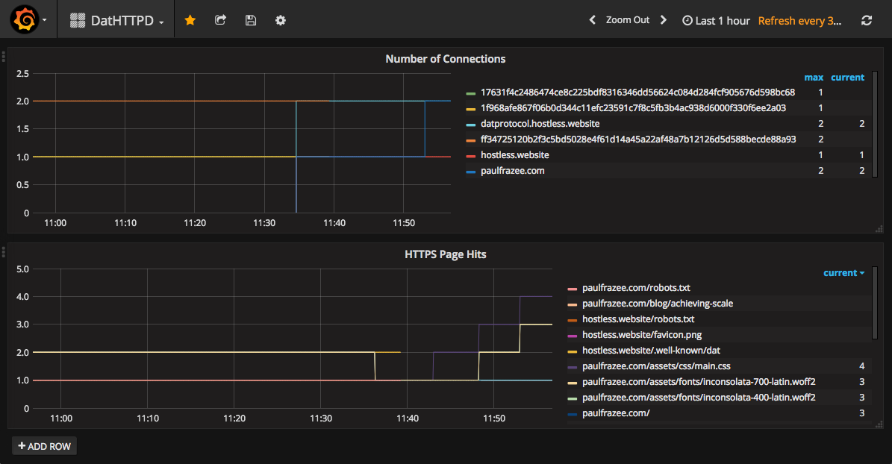

# Homebase

**WIP: not ready for anybody to use**

Easy-to-administer "pinning" server for [Dat](https://datprotocol.com). Keeps your dats online while your personal computer is off.

 - **Easy**. Designed for fast setup on linux-based servers and VPSes.
 - **Useful**. Provides the same features as [Hashbase](https://hashbase.io) but easier to self-host.
 - **Accessible**. Integrates with [Beaker](https://beakerbrowser.com) and the [Dat CLI](https://npm.im/dat) to add/remove Dats using the [Pinning Service API](#TODO).
 - **Automatic subdomains**.
   - You setup Homebase at a base domain (eg `yourdomain.com`).
   - You give your dats a name when you upload them (eg `mysite`).
   - Homebase gives the dat a subdomain (eg `dat://mysite.yourdomain.com`).
 - **Custom domains**. Any dat can be given additional custom domain names.
 - **HTTPS mirroring (optional)**. Any dat site can be accessed over https at the same domain.
 - **Let's Encrypt (optional)**. SSL certificates are fetched automatically.
 - **Metrics dashboard (optional)**. Track the stats on your dats.

## Table of contents

<!-- START doctoc generated TOC please keep comment here to allow auto update -->
<!-- DON'T EDIT THIS SECTION, INSTEAD RE-RUN doctoc TO UPDATE -->


- [How it works](#how-it-works)
- [Installation (Ubuntu)](#installation-ubuntu)
  - [Install script](#install-script)
  - [Manual install steps (alternative to install script)](#manual-install-steps-alternative-to-install-script)
- [Setup](#setup)
- [Command Line Flags](#command-line-flags)
- [Env Vars](#env-vars)
- [Guides](#guides)
  - [Metrics Dashboard](#metrics-dashboard)
  - [Running Homebase behind Apache or Nginx](#running-homebase-behind-apache-or-nginx)
- [Configuration file](#configuration-file)
  - [directory](#directory)
  - [domain](#domain)
  - [httpMirror](#httpmirror)
  - [webapi.enabled](#webapienabled)
  - [webapi.password](#webapipassword)
  - [letsencrypt.email](#letsencryptemail)
  - [letsencrypt.agreeTos](#letsencryptagreetos)
  - [ports.http](#portshttp)
  - [ports.https](#portshttps)
  - [dashboard.enabled](#dashboardenabled)
  - [dashboard.port](#dashboardport)
  - [dats](#dats)
  - [dats.*.url](#datsurl)
  - [dats.*.name](#datsname)
  - [dats.*.domain](#datsdomain)
  - [proxies](#proxies)
  - [proxies.*.from](#proxiesfrom)
  - [proxies.*.to](#proxiesto)
  - [redirects](#redirects)
  - [redirects.*.from](#redirectsfrom)
  - [redirects.*.to](#redirectsto)

<!-- END doctoc generated TOC please keep comment here to allow auto update -->

## Installation (Ubuntu)

You will need [nodejs](https://nodejs.org) version 4.9.1 or greater.

### Install script

To install or update Homebase, you can use the install script using curl:

```
curl -o- https://raw.githubusercontent.com/beakerbrowser/homebase/v1.0.0/install.sh | bash
```

or wget:

```
wget -qO- https://raw.githubusercontent.com/beakerbrowser/homebase/v1.0.0/install.sh | bash
```

Next, [setup your daemon](#setup).

### Manual install steps (alternative to install script)

You'll need to install some build dependencies:

```
# install build dependencies
sudo apt-get install libtool m4 automake libcap2-bin build-essential
```

Then install Homebase globally. See [this guide](https://docs.npmjs.com/getting-started/fixing-npm-permissions) if you run into permissions problems.

```
# install homebase
npm install -g @beaker/homebase
```

Because Homebase will use privileged ports 80 and 443, you'll need to give nodejs permission to use them. (It's not recommended to run Homebase as super-user.)

```js
# give node perms to use ports 80 and 443
sudo setcap cap_net_bind_service=+ep `readlink -f \`which node\``
```

Next, [setup your daemon](#setup).

## Setup

If you want to run Homebase manually, you can invoke the command `homebase`. However, for keeping the daemon running, we recommend [pm2](https://www.npmjs.com/package/pm2).

```
# install pm2
npm install -g pm2

# start homebase
pm2 start homebase
```

To configure your instance, edit `~/.homebase.yml`. You can edit this even if the homebase daemon is running, and it will automatically restart after changes to adopt the new config.

```
# configure
emacs ~/.homebase.yml
```

Here is an example config file:

```yaml
directory: ~/.homebase    # where your data will be stored
domain:                   # enter your homebase instance's domain here
httpMirror: true          # enables http mirrors of the dats
webapi:
  enabled: true           # enables integration with Beaker & Dat CLI
  password:               # enter your password here
letsencrypt:
  email:                  # enter your personal email here
  agreeTos: true          # you must agree to the LE terms (set to true)
ports:
  http: 80                # HTTP port for redirects or non-SSL serving
  https: 443              # HTTPS port for serving mirrored content & DNS data
dashboard:
  enabled: true           # enables the metrics dashboard
  port: 8089              # port for accessing the metrics dashboard
dats:
  # enter your pinned dats here
  - url:                  # URL of the dat to be pinned
    name:                 # the name of the dat (sets the subdomain)
    domain:               # (optional) the additional domains
proxies:
  # enter any proxied routes here
  - from:                 # the domain to accept requests from
    to:                   # the domain (& port) to target
redirects:
  # enter any redirect routes here
  - from:                 # the domain to accept requests from
    to:                   # the domain to redirect to
```

You'll want to configure the following items:

 - **Domain**. Set the `domain:` field to the top-level domain name of your Homebase instance. New archives will be hosted under its subdomains.
 - **Web API**. Set a password on the Web API if you want to publish to your Homebase using Beaker or the Dat CLI.
 - **Let's Encrypt**. This is required for accessing your archives with domain names. You'll need to provide your email address so that Let's Encrypt can warn you about expiring certs, or other issues. (Set this to `false` if you are running Homebase behind a proxy like Apache or Nginx.)
 - **Dats**. Add the archives that you want hosted. Each one will be kept online and made available at `dat://{name}.yourdomain.com`. The `domain` field is optional, and can take 1 or more additional domains for hosting the archive at. You can also add & remove archives using Beaker or the Dat CLI via the Web API.

Here's an example dat with multiple domains. If the Homebase instance is hosted at `yourdomain.com`, then this dat would be available at `dat://mysite.yourdomain.com`, `dat://mysite.com`, and `dat://my-site.com`. (Don't forget to setup the DNS records!)

```yaml
dats:
  - url: dat://1f968afe867f06b0d344c11efc23591c7f8c5fb3b4ac938d6000f330f6ee2a03/
    name: mysite
    domain:
      - mysite.com
      - my-site.com
```

If your Homebase is running on ports 80/443, and you have other Web servers running on your server, you might need Homebase to proxy to those other servers. You can do that with the `proxies` config. Here's an example proxy rule:

```yaml
proxies:
  - from: my-proxy.com
    to: http://localhost:8080
```

Sometimes you need to redirect from old domains to new ones. You can do that with the `redirects` rule. Here's an example redirect rule:

```yaml
redirects:
  - from: my-old-site.com
    to: https://my-site.com
```

Some other steps to make sure your Homebase instance works:

 - **Firewall rules**. Make sure your server is accessible by port 80 (http), 443 (https), and 3282 (dat).
 - **DNS records**. Be sure to create A records for all of your domains which point to your server's IP address.

To stop the daemon, run

```
# stop homebase
pm2 stop homebase
```

## Command Line Flags

  - `--config <path>` use the config file at the given path instead of the default `~/.dathttpd.yml`. Overrides the value of the `DATHTTPD_CONFIG` env var.

## Env Vars

  - `HOMEBASE_CONFIG=cfg_file_path` specify an alternative path to the config than `~/.homebase.yml`
  - `NODE_ENV=debug|staging|production` set to `debug` or `staging` to use the lets-encrypt testing servers.

## Guides

### Metrics Dashboard

Homebase has built-in support for [Prometheus](https://prometheus.io), which can be visualized by [Grafana](http://grafana.org/).



Homebase exposes its metrics at port 8089. Prometheus periodically scrapes the metrics, and stores them in a database. Grafana provides a nice dashboard. It's a little daunting at first, but setup should be relatively painless.

Follow these steps:

 1. [Install Prometheus](https://prometheus.io/download/) on your server.
 2. [Install Grafana](http://grafana.org/download/) on your server.
 3. Update the `prometheus.yml` config.
 4. Start prometheus and grafana.
 5. Login to grafana.
 6. Add prometheus as a data source to grafana. (It should be running at localhost:9090.)
 7. Import [this grafana dashboard](./grafana-dashboard.json).

Your prometheus.yml config should include have the scrape_configs set like this:

```yml
scrape_configs:
  - job_name: 'prometheus'
    static_configs:
      - targets: ['localhost:9090']
  - job_name: 'homebase'
    static_configs:
      - targets: ['localhost:8089']
```

### Running Homebase behind Apache or Nginx

If you are running Homebase on a server that uses Apache or Nginx, you may need to change your config to disable HTTPS. For instance, if you're using nginx and proxying to port `8080`, update your config to disable Let's Encrypt and to set the http port:

```yaml
letsencrypt: false
ports:
  http: 8080
```

You will need to add all domains to your Nginx/Apache config.

## Configuration file

The fields in detail.

### directory

The directory where homebase will store your Dat archive's files. Defaults to ~/.homebase.

### domain

The DNS domain of your homebase instance.

### httpMirror

Set to `true` to provide https mirroring of your Dat archives. Defaults to true.

### webapi.enabled

Set to `true` to provide the [Pinning Service API](#TODO) for integration with [Beaker](https://beakerbrowser.com) and the [Dat CLI](https://npm.im/dat). Defaults to false.

### webapi.password

Sets the password for your pinning service API. The username will be `admin`.

### letsencrypt.email

The email to send Lets Encrypt notices to.

### letsencrypt.agreeTos

Do you agree to the terms of service of Lets Encrypt? (Required, must be true)

### ports.http

The port to serve the HTTP sites. Defaults to 80.

HTTP automatically redirects to HTTPS.

### ports.https

The port to serve the HTTPS sites. Defaults to 443.

### dashboard.enabled

Set to `true` to provide the [prometheus metrics dashboard](#metrics-dashboard). Defaults to false.

### dashboard.port

The port to serve the [prometheus metrics dashboard](#metrics-dashboard). Defaults to 8089.

### dats

A listing of the Dat archives to host.

You'll need to configure the DNS entry for the hostname to point to the server. For instance, if using `site.yourhostname.com`, you'll need a DNS entry pointing `site.yourhostname.com` to the server.

### dats.*.url

The Dat URL of the site to host.

### dats.*.name

The name of the Dat archive. Must be unique on the Homebase instance. The archive will be hosted at `{name}.yourhostname.com`. You'll need to configure the DNS entry for the hostname to point to the server.

### dats.*.domain

Additional domains of the Dat archive. Can be a string or a list of strings. You'll need to configure the DNS entry for the hostname to point to the server.

### proxies

A listing of domains to proxy. Useful when your server has other services running that you need available.

### proxies.*.from

The domain to proxy from.

### proxies.*.to

The protocol, domain, and port to proxy to.

### redirects

A listing of domains to redirect.

### redirects.*.from

The domain to redirect from.

### redirects.*.to

The base URL to redirect to.